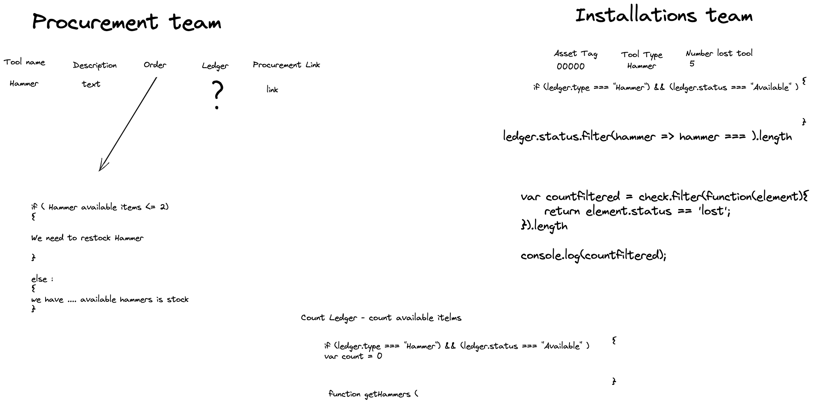

## Overview

After I received the task and analysed that the objective is 
that we order tools at right time and also to keep track of lost tools.

## The Brief
We need to create a simple internal microsite that uses the Airtable API to show us:
* Which tools we should consider re-ordering immediately
* Any tools that have been lost / are missing
This microsite will be used by two separate teams:
* The procurement team, who will be responsible for placing orders for restocking
* The Installations Installations team, to track down any tools lost by Engineers


When I have a good look at the task  I started with whiteboarding.



## Technologies Used

- **API**:
  * Airtable
- **Frontend**:
  * JavaScript (ES6)
  * React.js
  * HTML5
  * CSS3
  * Bulma
  * React-router-dom

  ## Installation Instructions

1. Clone repo code from GitHub onto your machine.
2. Use `yarn` or `npm` to install all dependencies from the `package.json` file.
3. Start server: <code>yarn start</code>/<code>npm start</code>

## General Approach & Planning

After reading the Airtable documentation and generating the API key I stored the key in the .env file.
Then I created const <code>base</code> that I used later to fetch the data.
```js 
const API_KEY = process.env.REACT_APP_API_KEY
const base = new Airtable({ apiKey: `${API_KEY}` }).base('app5MyMq1VN6a1Zvu')
```
I used React Hooks  <code>React.useEffect </code> and <code>React.useState</code> to fetch the data. 
```js
function App() {
  const [ledger,setLedger] = React.useState([])
  const [tools,setTools] = React.useState([])
  React.useEffect(()=>{
    base('Ledger')
      .select({ view: 'Grid view' })
      .eachPage((records, fetchNextPage)=>{
        setLedger(records)
        console.log(records)
        console.log(records[0].fields['Asset Tag'].text)
        console.log(records[0].fields['Tool Type'])
        
        fetchNextPage()
      })
      
    base('Tools')
      .select({ view: 'Grid view' })
      .eachPage((records, fetchNextPage)=>{
        setTools(records)
        console.log(records)
        console.log(records[0].fields['Tool Name'])
        console.log(records[0].id)
        fetchNextPage()
      })
   ``` 


